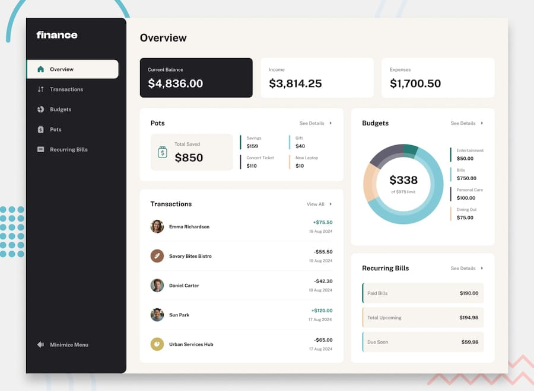

# Personal finance app

A full-stack personal finance app — budgets, savings pots, transactions and
recurring bills — built as a solution to the
[Frontend Mentor "Personal finance app" challenge](https://www.frontendmentor.io/challenges/personal-finance-app-JfjtZgyMt1)
(guru level).



> The image above is the supplied design, not a screenshot of the build.
> Replace it once the UI is finished.

---

## Status

Work in progress. Honest state of play:

| Area | Status |
|---|---|
| Design tokens (colour, type, spacing) | Done |
| Database schema + seed | Done |
| Service layer (balance, pots) | Done |
| App shell and navigation | Done |
| Pots page | Renders live data; actions not wired |
| Transactions / Budgets / Recurring bills | Stubs |
| Overview | Stub (built last — it aggregates everything else) |
| Authentication | Not started |

---

## Built with

- **Next.js 16** (App Router) and **React 19**
- **TypeScript**
- **CSS Modules** with custom properties — no CSS framework
- **PostgreSQL** (Neon) with **Drizzle ORM**
- Self-hosted **Public Sans** via `next/font/local`

---

## Key decisions

### Money is an append-only ledger

Balances aren't stored and overwritten. Every movement of money is a row in a
single `entries` table, signed from the main balance's point of view, which
makes two facts fall out of one column:

```
current balance  =  SUM(amount_cents)
a pot's total    = -SUM(amount_cents) WHERE pot_id = <pot>
```

Money moving *into* a pot is negative because it leaves the balance. Nothing is
ever updated or deleted: withdrawing from a pot appends a row, and deleting a
pot appends a compensating row and sets `closed_at`. The history stays readable.

The supplied `data.json` states a balance of `$4,836.00` that its 49
transactions cannot account for. Rather than invent history, the difference is
recorded as a single explicit `opening_balance` entry of `$3,571.50` — computed
from the figure that has to come out. The seed script asserts the ledger
reconciles and aborts if it ever stops.

### `entries` is polymorphic, and the database enforces its shape

Three kinds of row share one table, which normally invites half-filled records.
A `CHECK` constraint forces each kind to carry exactly its own fields. Without
it a transaction row could arrive carrying a `pot_id` and silently corrupt every
pot total summed over it.

Budgets and pots use **partial unique indexes** (`WHERE closed_at IS NULL`), so
"one budget per category" and "no duplicate pot names" hold in the database
rather than in form validation — while closed records still free their name up.

### Money is integer cents, never floats

`data.json` demonstrates why: its stored `expenses` total is `1700.50`, but
summing its own transactions gives `1699.75`.

### "Today" is pinned, and a lint rule enforces it

The challenge data is frozen in August 2024. Budgets show "spent this month"
and recurring bills are "due within five days" of the latest transaction, so
the real system clock would silently produce wrong numbers — no crash, just an
app that quietly disagrees with the design.

All time comes from `getNow()` in `lib/clock.ts`, and an ESLint rule rejects
bare `new Date()` and `Date.now()` everywhere else. Month boundaries are
computed in UTC deliberately, since the seed timestamps are UTC. To run on real
time, delete `NEXT_PUBLIC_APP_NOW` from `.env.local` — that's the whole change.

### Auth is deferred but not unplanned

Every table already carries `userId`, and every caller gets it from
`getCurrentUser()` in `lib/services/auth.ts`. Adding real sessions replaces one
function body rather than threading a new argument through the app.

### Icons are CSS masks, not images

The supplied SVGs have their fill colour baked in, so an `` could never
turn green when active or respond to hover. Used as a `mask` with
`background-color: currentColor`, each file becomes a stencil that inherits
colour — one CSS rule instead of maintaining recoloured copies.

### Sidebar state lives in a cookie

The minimise flag is read server-side in the layout, so the correct rail width
is in the first HTML response. `localStorage` would render the full 300px rail
and snap to 88px on every page load.

---

## Deliberate deviations from the design

Three places where the supplied material is internally inconsistent and the
app does something defensible instead.

**Expenses show `$1,699.75`, the design shows `$1,700.50`.** The stored
aggregate disagrees with the sum of its own transactions. A finance app whose
total contradicts its line items is worse than one 75c off a mockup, so the
figure is derived.

**The Gift pot is `$40 / $60`.** `data.json` duplicated Concert Ticket's
`110/150`, but the design shows `$40` with a `66.6%` bar — which only works
against a `$60` target. The challenge README says the designs win.

**Progress percentages truncate to one decimal rather than rounding.**
Tested against the five mockup values, truncation matches four where rounding
matches two. It is also the right bias: never show someone further along than
they are.

---

## Running locally

### Prerequisites

- Node.js 20.12 or newer
- A PostgreSQL database (this project uses a [Neon](https://neon.tech) free tier)

### Setup

```bash
npm install

cp .env.example .env.local
# then set DATABASE_URL in .env.local

npm run db:migrate   # create the schema
npm run db:seed      # load the challenge data and verify it reconciles

npm run dev          # http://localhost:3000
```

`/design-system` renders every design token, which is useful for checking a
value against Figma.

### Scripts

| Script | Purpose |
|---|---|
| `npm run dev` | Development server |
| `npm run build` | Production build |
| `npm run lint` | ESLint |
| `npm run db:generate` | Generate a migration from schema changes |
| `npm run db:migrate` | Apply pending migrations |
| `npm run db:seed` | Reset and reseed (asserts the ledger reconciles) |
| `npm run db:studio` | Drizzle Studio |

---

## Project structure

```
app/
  (dashboard)/        routes sharing the sidebar shell
  design-system/      every token, rendered
  fonts/              self-hosted Public Sans + OFL licence
  globals.css         design tokens and typography utilities
components/
  pots/  sidebar/  ui/
lib/
  clock.ts            the app's pinned "today"
  money.ts            integer-cent helpers and formatting
  db/                 schema, client, seed data
  design/tokens.ts    palette the theme picker needs at runtime
  services/           all database access
drizzle/              generated migrations
```

Server Components import from `lib/services` directly. Route Handlers will wrap
the same functions, so the API is real without a Server Component ever fetching
its own endpoint over HTTP.

---

## What's next

1. Wire the pot modals (add, edit, delete, add money, withdraw)
2. Transactions — server-side search, sort, filter and pagination via URL params
3. Budgets, including the donut chart
4. Recurring bills (one row per vendor; paid / due soon / upcoming)
5. Overview
6. Accessibility pass — full keyboard operation is a requirement, not a nicety
7. Authentication
8. Deploy

---

## Acknowledgements

Challenge and design by [Frontend Mentor](https://www.frontendmentor.io).
Public Sans is licensed under the SIL Open Font License; see
`app/fonts/OFL.txt`.
